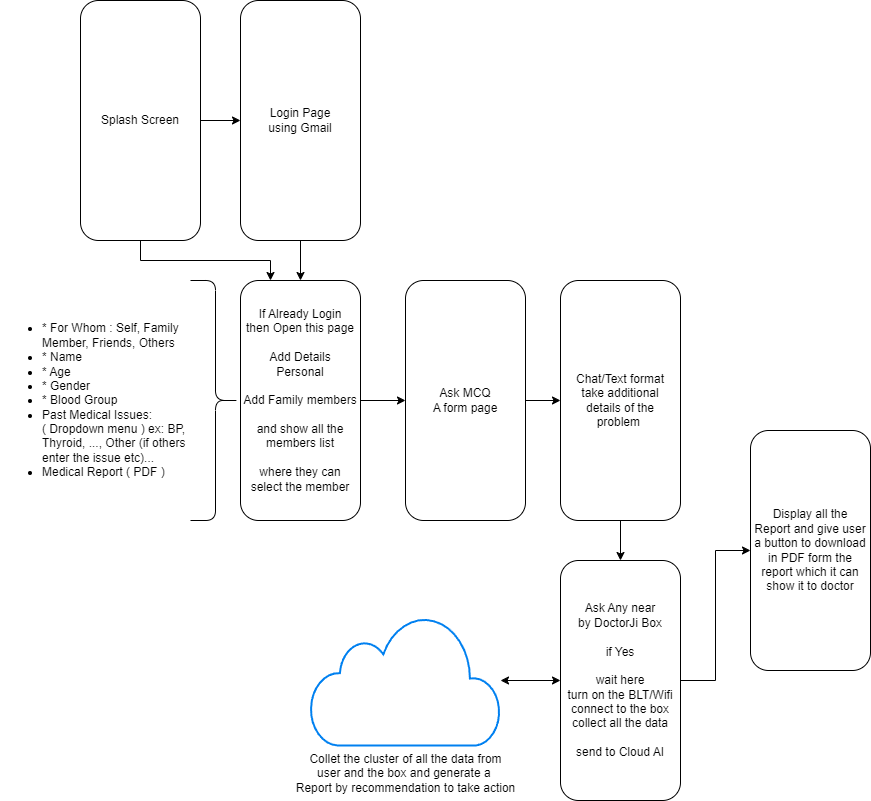

# RogiDoot-VirtualCare

**Project Name**: RogiDoot-VirtualCare  
**Final Year Project**  
**Description**: PSCS46 - Diagnosis of Acute Diseases Using AI (Max Healthcare)  
**Technology Domain**: Healthcare & Biomedical Devices  
**Complexity**: Complicated  
**Interest Match**: MERN Stack, IoT (ESP32), AI (Custom LLMs, Gemini API), Flutter, Firebase  

## Table of Contents
- [Introduction](#introduction)
- [Project Goals](#project-goals)
- [Technology Stack](#technology-stack)
- [Project Workflow](#project-workflow)
- [AI Diagnosis Process](#ai-diagnosis-process)
- [Mobile Application Flow](#mobile-application-flow)
- [IoT Integration with ESP32](#iot-integration-with-esp32)
- [How to Run the Project](#how-to-run-the-project)
- [Contributing](#contributing)
- [License](#license)
- [Detailed Documentation](#detailed-documentation)
- [Collaborators](#collaborators)

---

## Introduction
RogiDoot-VirtualCare is an AI-based virtual doctor system designed to assist in diagnosing common diseases such as cold and flu, particularly for rural areas with limited access to healthcare. The app collects health data from users and their family members, processes the data using AI trained on large language models (LLMs) and the Gemini API, and offers diagnostic treatment recommendations.

The application is designed with a user-friendly interface in mind, supporting multiple Indian languages to make it accessible for a broader audience.

---

## Project Goals
- **Diagnose common diseases** using AI models based on user input and IoT-collected data.
- **Support rural healthcare** by providing quick and accessible health services.
- **AI integration** for disease diagnosis and treatment recommendation.
- **Real-time monitoring** using ESP32 for vitals like heart rate, body temperature, and more.
- **Support Indian languages** for ease of use.
- **Referral to nearby doctors** when necessary.

---

## Technology Stack
- **Front-End**: Flutter (Mobile application)
- **Back-End**: Node.js (MERN Stack)
- **Database**: Firebase (User data storage and authentication)
- **AI**: Custom AI model with LLMs and Gemini API
- **IoT**: ESP32 for vital monitoring
- **Languages**: Indian language support for device interaction and reporting

---

## Project Workflow

1. **User Registration & Login**:  
   - The user signs up or logs into the app. Firebase handles authentication and stores basic user information.
   - After logging in, the user can add family members to monitor their health as well.

2. **Family Members & Health Data Input**:  
   - Each family member can be added to the app with basic information.
   - The user or family member answers basic questions (Q&A and MCQs) related to their symptoms, which are passed to the AI for analysis.

3. **AI Diagnosis**:  
   - Based on the responses, the AI evaluates potential illnesses and suggests a diagnosis.
   - If a nearby virtual doctor is available, the user can connect to IoT devices (ESP32) for remote health monitoring.

4. **IoT Data Collection**:  
   - The ESP32 collects essential health data, including:
     - Heart rate
     - Blood pressure
     - Respiratory rate
     - Body temperature
     - Body oxygen levels
     - ECG
     - Environmental factors: Temperature, Humidity, Air Quality, Location
   - The device communicates instructions in the selected Indian language.

5. **Report Generation**:  
   - The AI combines user inputs and IoT-collected data.
   - A comprehensive health report is generated using LLMs and the Gemini API.
   - The report provides diagnostic treatment recommendations and alerts the user to visit a nearby doctor if necessary.

6. **Doctor Referral**:  
   - If the diagnosis shows severe conditions, the app recommends nearby doctors for further consultation.

---

## AI Diagnosis Process

The custom AI model is trained using large language models and integrated with the Gemini API to analyze user inputs and IoT data. It generates reports that offer diagnostic treatment plans. The process includes:

1. **User Inputs**: Symptom-based questions and answers collected via the app.
2. **IoT Data**: Vital signs measured using the ESP32 and sent to the app.
3. **AI Processing**: The AI model processes the combined data, generating a detailed diagnostic report with possible actions and treatments.
4. **Report Delivery**: The AI provides the final report in the user’s preferred language, with treatment suggestions or referrals if necessary.

---

## Mobile Application Flow

Here’s how the mobile application will flow:

1. **User Login/Register**  
   - Using Firebase, the user can either register or log in to the system.
  
2. **Add Family Members**  
   - Once logged in, the user can add family members and manage their health profiles.

3. **AI Symptom Analysis**  
   - The AI will prompt users to answer a set of questions about their symptoms.

4. **Virtual Doctor Consultation**  
   - If IoT devices are available, health vitals will be collected for further analysis.

5. **Report Generation**  
   - After analysis, a report will be generated with recommendations.

6. **Consultation with a Doctor**  
   - In case of severe symptoms, the app will suggest visiting the nearest doctor.

Below is a simplified flowchart to illustrate the process:



---

## IoT Integration with ESP32

The ESP32 board plays a critical role in real-time health monitoring. It collects data such as heart rate, respiratory rate, temperature, etc., and sends it to the mobile application. The data is processed alongside user inputs and sent to the AI for report generation.

**Key Data Collected**:
- Heart Rate
- Blood Pressure
- Body Temperature
- Body Oxygen Level
- ECG
- Environmental Data (Temperature, Humidity, Air Quality)

Below is the hardware flowchart for IoT integration:


---

## How to Run the Project

### Mobile App:
1. Clone the repository.
2. Install Flutter dependencies:
   ```bash
   flutter pub get
   ```
3. Set up Firebase:
   - Create a Firebase project and configure Firebase for the mobile app.
   - Add Firebase authentication and Firestore for data storage.
4. Run the app on an Android or iOS emulator:
   ```bash
   flutter run
   ```

### IoT Device (ESP32):
1. Upload the ESP32 code to the microcontroller using the Arduino IDE.
2. Connect the sensors and verify data transmission to the mobile app.

---

## Contributing
Feel free to contribute by opening pull requests or reporting issues.

Here are the additional subheadings for your README file:

---

## License

This project is licensed under the GNU General Public License (GPL) v3.0, which means that you are free to use, modify, and distribute the project under the terms of the **GNU Copyleft License**.

For more information about the GNU GPL license, please refer to the [official documentation](https://www.gnu.org/licenses/gpl-3.0.html).

---

## Detailed Documentation

For a more detailed description of the specific modules and technologies used in this project, please refer to the respective folders. Each folder contains a dedicated README file that explains the implementation, setup, and usage of that particular module in detail.

- **Mobile Application**: `docs/mobile_app/README.md`
- **IoT Integration**: `docs/iot_integration/README.md`
- **AI Model**: `docs/ai_model/README.md`

Feel free to explore these folders for a deeper understanding of the project's components.

## Collaborators

This project has been a collective effort of the following team members. Below are the contributors who collaborated on this project:

<a href="https://github.com/angular/angular-ja/graphs/contributors">
  
</a>

Made with [contrib.rocks](https://contrib.rocks).